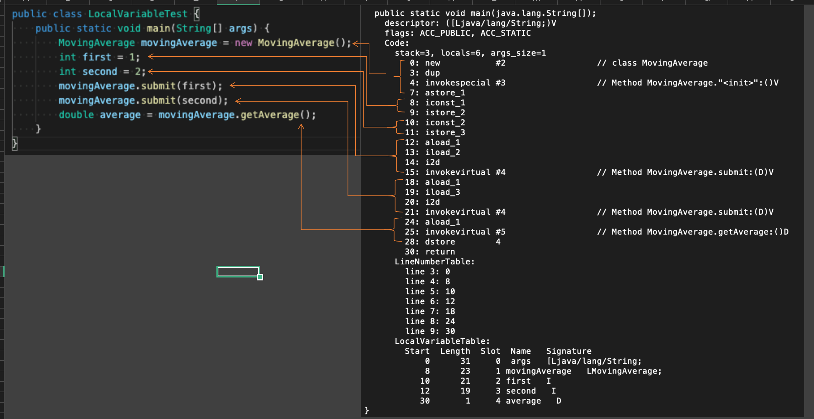
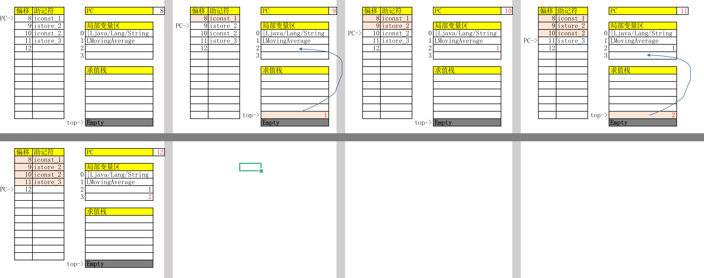
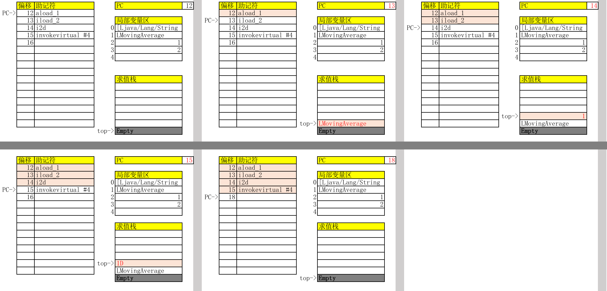

# 字节码分析
## 准备工作

将src下的文件编译，并将编译后的class放在target文件夹下
```bash
javac -g -d ./target ./src/*.java
```

以LocalVariableTest的字节码举例
```bash
javap -c -v ./target/LocalVariableTest
```

针对main方法的分析


针对first以及second赋值的分析


针对movingAverage.sumbit(first)的分析
