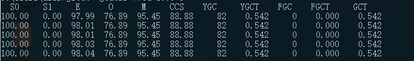
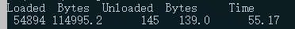

# jvm 工具使用初探
查询jvm中的进程
```bash
jps
```
## jstat
以idea举例，查询各个内存使用率，采样间隔为1000毫秒，共采样5次
```
jstat -gcutil 7764 1000 5
```

从图中可以看出:
1. S0 = 100,0号存活区的使用率是100%
2. S1 = 0,1号存活区的使用率是0，这个是正常的，S0和S1总有一个是空的
3. E 表示整个新生代的使用比例
4. O 表示整个老年代的使用比例
5. M 表示元空间的使用比例
6. CCS 表示压缩Class指针的使用比例
7. YGC 表示发生Young GC的次数
8. YGCT 表示年轻代的Young GC 的总时间，图中的例子可以看出，单次GC的时间大约为 542ms/82次 = 6.6ms/次
9. FGC 表示发生FullGC的次数
10. FGCT 表示FullGC的总时间
11. GCT 表示YGCT+FGCT，也就GC的总耗时

查看类加载的情况
```bash
jstat -class 7764
```


## T.B.D