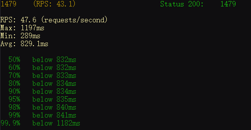
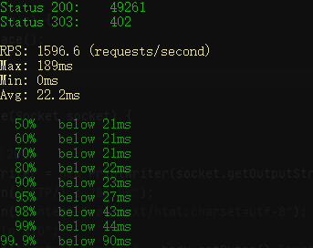
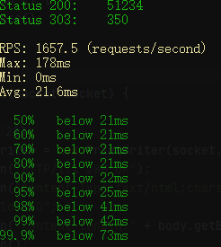
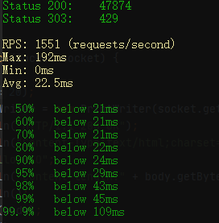
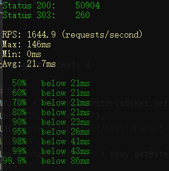
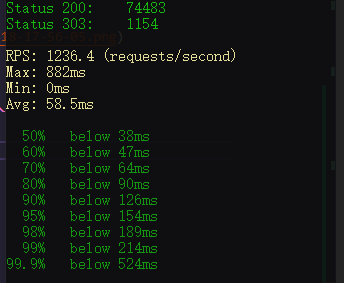
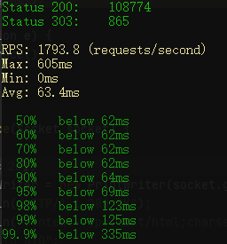

# ex01

阻塞线程下的性能表现

```bash
sb -u http://localhost:8801 -c 40 -N 30
```



每个请求都创建新的线程

```bash
sb -u http://localhost:8802 -c 40 -N 30
```


固定40线程的线程池

```bash
sb -u http://localhost:8803 -c 40 -N 30
```


## 单线程与多线程的区别

这个很明显，无论是请求一来就创建线程，或者先维护一个线程池，其性能都是远远超过单线程执行的。那么不限制数量和限制线程数量的做法有什么具体的区别呢？看上去是固定线程池性能好一些（截图只是其中的一次数据，实际上针对方式2和方式3都经过了多次测试，多次测试的结果似乎都表达了一个意思--固定线程池的性能相对于不限定线程数量的做法要更好一些）

## 限制最大堆内存为512mb下的性能表现
首先是不限制线程数量的版本



接着是线程池版本



依然有些微的差距，线程池版本的数据还是由于其他版本。

## 进一步的，将Super Benchmarker的并发数量调整到120个

非线程池版本



线程池版本



可以看出，这个时候的差距开始明显了起来