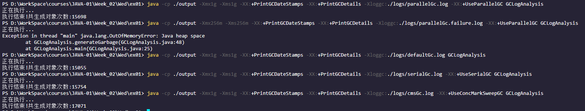

# 串行 / 并行 /CMS / G1 
## 准备工作

将src下的文件编译，并将编译后的class放在target文件夹下
```bash
javac -encoding "utf-8" -g -d ./output ./src/*.java
```

使用并行GC，在堆内存分配1g的情况下，通过日志文件记录GC情况

```bash
java -cp ./output -Xmx1g -Xms1g -XX:+PrintGCDateStamps -XX:+PrintGCDetails -Xloggc:./logs/parallelGc.log -XX:+UseParallelGC GCLogAnalysis
```

使用并行GC，在堆内存分配256m的情况下，通过日志文件记录GC情况(这次运行出现了OOM的问题)

```bash
java -cp ./output -Xmx256m -Xms256m -XX:+PrintGCDateStamps -XX:+PrintGCDetails -Xloggc:./logs/parallelGc.failure.log -XX:+UseParallelGC GCLogAnalysis
```

使用默认GC，在堆内存分配1g的情况下，通过日志文件记录GC情况

```bash
java -cp ./output -Xmx1g -Xms1g -XX:+PrintGCDateStamps -XX:+PrintGCDetails -Xloggc:./logs/defaultGc.log GCLogAnalysis
```

使用串行GC，在堆内存分配1g的情况下，通过日志文件记录GC情况

```bash
java -cp ./output -Xmx1g -Xms1g -XX:+PrintGCDateStamps -XX:+PrintGCDetails -Xloggc:./logs/serialGc.log -XX:+UseSerialGC GCLogAnalysis
```

使用CMS GC(并发)，在堆内存分配1g的情况下，通过日志文件记录GC情况

```bash
java -cp ./output -Xmx1g -Xms1g -XX:+PrintGCDateStamps -XX:+PrintGCDetails -Xloggc:./logs/cmsGc.log -XX:+UseConcMarkSweepGC GCLogAnalysis
```

使用G1 GC，在堆内存分配1g的情况下，通过日志文件记录GC情况

```bash
java -cp ./output -Xmx1g -Xms1g -XX:+PrintGCDateStamps -XX:+PrintGCDetails -Xloggc:./logs/g1Gc.log -XX:+UseG1GC GCLogAnalysis
```

不同GC策略下的对象生成情况



