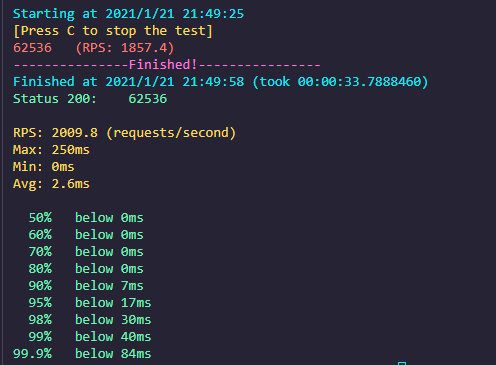
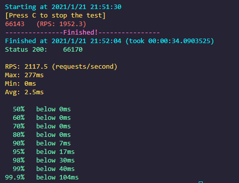
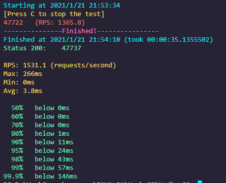
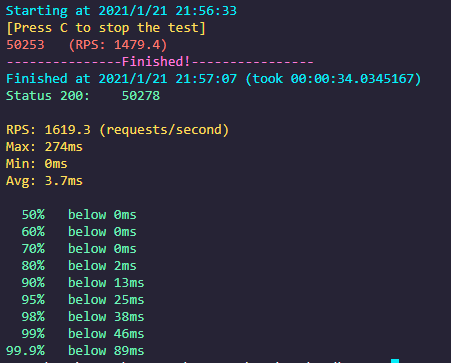

# 压测gateway-server-0.0.1-SNAPSHOT.jar
## 准备工作

使用 Super BenchMarker 压测

```bash
sb -u http://localhost:8088/api/hello -c 40 -N 30
```

使用并行GC，在堆内存分配1g的情况下，通过日志文件记录GC情况

```bash
java -Xmx1g -Xms1g -XX:-UseAdaptiveSizePolicy -XX:+PrintGCDateStamps -XX:+PrintGCDetails -Xloggc:./logs/parallelGc.log -XX:+UseParallelGC -jar ./resource/gateway-server-0.0.1-SNAPSHOT.jar
```



使用串行GC，在堆内存分配1g的情况下，通过日志文件记录GC情况

```bash
java -Xmx1g -Xms1g -XX:-UseAdaptiveSizePolicy -XX:+PrintGCDateStamps -XX:+PrintGCDetails -Xloggc:./logs/serialGc.log -XX:+UseSerialGC -jar ./resource/gateway-server-0.0.1-SNAPSHOT.jar
```



使用CMS GC(并发)，在堆内存分配1g的情况下，通过日志文件记录GC情况

```bash
java -Xmx1g -Xms1g -XX:-UseAdaptiveSizePolicy -XX:+PrintGCDateStamps -XX:+PrintGCDetails -Xloggc:./logs/cmsGc.log -XX:+UseConcMarkSweepGC -jar ./resource/gateway-server-0.0.1-SNAPSHOT.jar
```



使用G1 GC，在堆内存分配1g的情况下，通过日志文件记录GC情况

```bash
java -Xmx1g -Xms1g -XX:-UseAdaptiveSizePolicy -XX:+PrintGCDateStamps -XX:+PrintGCDetails -Xloggc:./logs/g1Gc.log -XX:+UseG1GC -jar ./resource/gateway-server-0.0.1-SNAPSHOT.jar
```

