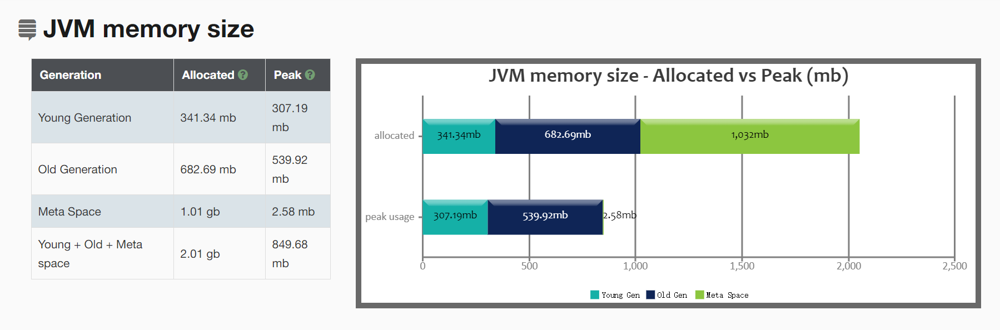

# 不同GC和堆内存的分析

1g 内存下各GC的表现
| GC | YoungGC 次数 | YoungGC 平均时间 | Full GC 次数 | Full GC 平均时间 |GC总时间|
| :- | :- | :- | :- | :- | :- |
|Parallel| 27 | 10ms | 2 | 50ms |370ms|
|Serial| 16 | 30ms | 2 | 50ms |580ms|
|CMS| 14 | 20ms | 2 | 50ms |380ms|

简单来看，串行化GC的耗时相对于并行GC和并发GC的较久，并行和并发之间的差异并不是很大

1g 内存下经过压测后的GC表现
| GC | YoungGC 次数 | YoungGC 平均时间 | Full GC 次数 | Full GC 平均时间 |GC总时间|
| :- | :- | :- | :- | :- | :- |
|Parallel| 10 | 10ms | 2 | 35ms |170ms|
|Serial| 8 | 20ms | 2 | 50ms |260ms|
|CMS| 7 | 14ms | 0 | 0 |100ms|
很神奇，并行GC的优势在这里体现了出来，具体表现在GC工作对业务线程的干扰，相较于其他GC更少

通过 gceasy.io 在线对 wed-ex-1 CMS GC的分析

