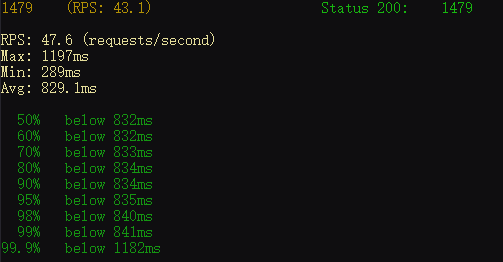
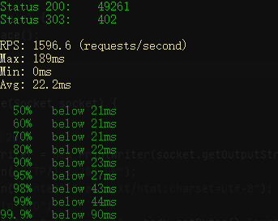
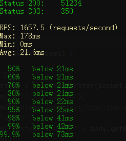

# ex01

阻塞线程下的性能表现

```bash
sb -u http://localhost:8801 -c 40 -N 30
```



每个请求都创建新的线程

```bash
sb -u http://localhost:8802 -c 40 -N 30
```


固定40线程的线程池

```bash
sb -u http://localhost:8803 -c 40 -N 30
```
