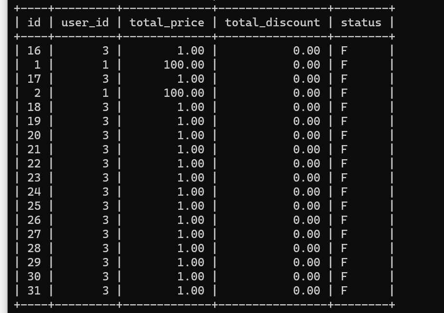
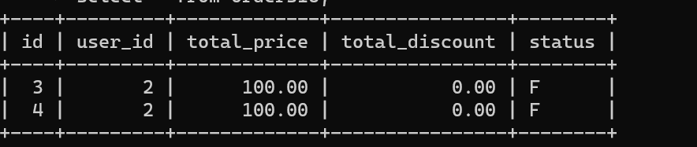

# 学习笔记

## 作业

### 周三

#### ex02 设计对前面的订单表数据进行水平分库分表，拆分 2 个库，每个库 16 张表。。。

[配置](week08-wed-02/src/main/java/com/alex/homework/week08wed02/config/DataSourceConfiguration.java)

[实现](week08-wed-02/src/main/java/com/alex/homework/week08wed02/Week08Wed02Application.java)

---

### 周日

#### ex02 基于 hmily TCC 或 ShardingSphere 的 Atomikos XA 实现一个简单的分布式事务应用 demo

[Atomikos](week08-sun-02/src/main/java/com/alex/homework/week08sun02/Week08Sun02Application.java) 

## 笔记

### 数据库拆分

#### 大库导致的问题

* 无法执行DDL，应执行时间太长，期间会锁表，导致业务无法推进
* 同样受锁表开销影响，无法备份
* 主从延时逐渐升高，性能变差

#### 读写分离到数据库拆分

* 单机容量有限，只有拆库，将数据分布到不同的设备上，才有扩展容量的可能

#### 垂直拆分的优缺点

优点

* 单库变小，便于管理和维护
* 对性能和容量有提升作用
* 改造后的系统复杂度降低
* 可以作为微服务改造的基础

缺点

* 库变多引起的管理复杂度变高
* 对业务系统的侵入性变强
* 改造过程复杂，容易出故障
* 有拆分极限

#### 垂直拆分的一般步骤

1. 梳理清楚拆分的范围和影响范围
2. 检查评估和重新影响到的服务
3. 准备新的数据库集群复制数据
4. 修改系统配置并发布新版上限

#### 水平拆分

* 分库
* 分表
* 分库分表

#### 分库分表的优缺点

优点

* 解决容量问题
* 比垂直拆分对系统影响小
* 部分提升性能和稳定性

缺点

* 集群规模单，管理复杂
* 复杂SQL支持问题
* 数据迁移问题
* 一致性问题
