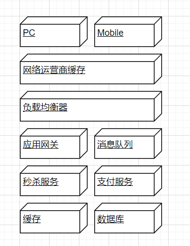

# 学习笔记

## 作业

### Sun

针对课上讲解的内容，自己动手设计一个高并发的秒杀系统，架构图，设计文档

+ 

设计思路

1. 采用CDN，将静态资源放在CDN中，尽量减少服务器端的带宽压力
2. 动静隔离，虽然采用了CDN，但是还是有相当一部分的请求到达了服务器，秒杀未开始时，大部分的流量都是在获取秒杀的图片上，那么，就有必要将这些静态的资源放到单独的集群里。同样，不止是图片，部分网页比如商品详情这类的页面也可以做成静态页面，避免从数据库中频繁查询。
3. 静态资源压缩，静态资源服务器返回的将是压缩过的文件，解压过程放在客户端进行。通过客户端来分担服务端的压力，也减少了对带宽的占用
4. 减少单个页面的Http请求，将样式文件和部分js的内容直接写在页面里，而不是加载单独的css文件或js文件，通过这种方式可以减少单个页面加载时的http请求
5. 限流熔断，由于秒杀请求无穷而秒杀成功的有限，所以可以在服务器前端放置一个计数的服务，当请求到达秒杀上限时，对后续的请求进行引流，提示用户秒杀失败或秒杀结束，不再访问正式的服务器，通过这种方式，真正到达服务器的请求被控制在相当有限的范围里。
6. 异步消息，可以通过消息队列产品来做限流熔断器，将秒杀成功的请求进一步进行延迟，避免服务器同时处理大量请求。也可以利用缓存系统作为前置的计数器，通过的秒杀请求发送到消息队列，再由消息队列延迟发送消息。
7. 下单URL延迟推送，秒杀尚未开始时，为了避免用户提前知道秒杀系统的地址，可以将秒杀按钮的点击操作放在一个空的js文件里，秒杀开始前，用户即便请求了这个js文件，得到的依然是一个空文件，或者干脆请求不到。当秒杀开始时，可以通过提前写好的程序，将这个js文件上传到服务器。用户这时再来请求就可以访问到下单请求了。
8. 应用调优，当时间充分时，可以在秒杀活动前，预留充分的时间对服务器进行调优，比如JVM，apache等web中间件。对这些调优的结果进行更加充分的测试。
9. 服务器资源吃紧时，可以适当的放弃一些非核心的功能
